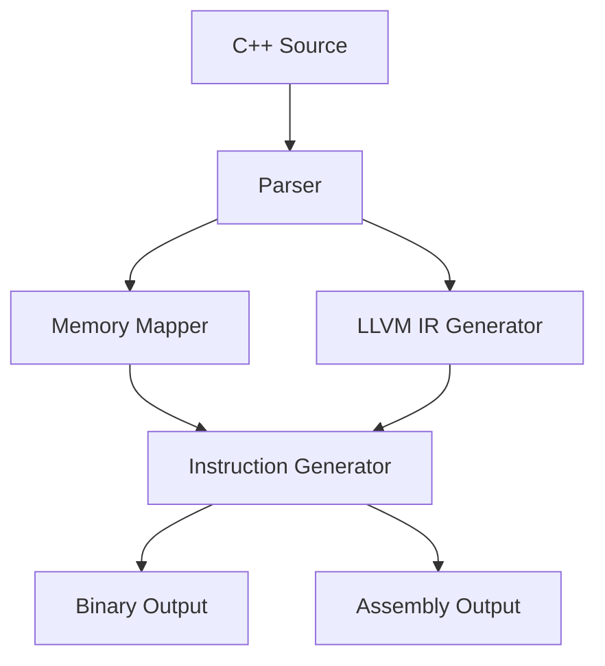

# PIM Compiler for Matrix Multiplication
**A Complete Solution for AI/ML Acceleration on Processor-in-Memory Architectures**

## Table of Contents
1. [System Overview](#system-overview)
2. [Architecture Design](#architecture-design)
3. [Memory Subsystem](#memory-subsystem)
4. [Instruction Set Architecture](#instruction-set-architecture)
5. [Compilation Pipeline](#compilation-pipeline)
6. [Optimization Strategies](#optimization-strategies)
7. [API Reference](#api-reference)
8. [Usage Examples](#usage-examples)
9. [Performance Characteristics](#performance-characteristics)
10. [Future Roadmap](#future-roadmap)

---

## System Overview

### Key Features
- **C++ Source Compatibility**: Parses standard matrix multiplication code
- **Bank-Aware Memory Mapping**: Intelligent physical memory allocation
- **Custom ISA Generation**: 24-bit optimized instruction stream
- **Multi-Format Output**: Binary, assembly, and verification files
- **LLVM Integration**: Optional IR generation and optimization

### Technical Specifications
| Category              | Specification                          |
|-----------------------|---------------------------------------|
| Target Architecture   | 8-bank PIM with 512 rows × 64 columns |
| Instruction Width     | 24-bit fixed format                   |
| Data Type Support     | 32-bit integers (initial version)     |
| Parallelism           | 8 clusters per bank                   |
| Memory Bandwidth      | 2 ops/cycle (read+write)              |

---

## Architecture Design

### Component Diagram


### Core Modules

- **Frontend Parser**
  - Extracts matrix dimensions and access patterns
  - Supports multiple C++ syntax variants
  - Dependency analysis

- **Memory Mapper**
  - Physical address translation
  - Bank conflict avoidance
  - Allocation tracking

- **Instruction Generator**
  - Operation scheduling
  - Hazard detection
  - Instruction encoding

## Memory Subsystem

### Physical Organization
```python
# Hardware Constants
BANK_COUNT = 8
ROWS_PER_BANK = 512
COLUMNS_PER_ROW = 64  
CLUSTER_COUNT = 8

# Address Mapping Formula
def get_physical_address(bank, row, col):
    return (bank << 19) | (row << 6) | col
```

### Allocation Algorithm
```python
def allocate_matrix(name, rows, cols):
    # Calculate required resources
    row_span = ceil(cols / COLUMNS_PER_ROW)
    
    # Find contiguous space
    while True:
        if current_bank.has_space(row_span):
            addr = MemoryAddress(current_bank, current_row)
            allocations[name] = (addr, rows, cols)
            current_row += row_span
            if current_row >= ROWS_PER_BANK:
                current_bank = (current_bank + 1) % BANK_COUNT
                current_row = 0
            return addr
        else:
            current_bank = (current_bank + 1) % BANK_COUNT
            current_row = 0
```

## Instruction Set Architecture

### Format Specification
```
 23                    16 15 14 13      5 4     0
+-----------------------+--+--+----------+-------+
|       Operation       |RD|WR| Address  |Reserved|
+-----------------------+--+--+----------+-------+
```

### Instruction Types
| Mnemonic | Opcode | Description |
|----------|--------|-------------|
| PROG     | 01     | Program LUT core |
| EXE      | 10     | Execute operation |
| RD       | 00     | Memory read (WR=0) |
| WR       | 00     | Memory write (RD=0) |
| RDWR     | 00     | Read-modify-write (RD=WR=1) |
| NOOP     | 00     | No operation |
| END      | 11     | Terminate execution |

## Compilation Pipeline

### Stage 1: Source Parsing
- Lexical analysis
- Dimension extraction
- Loop pattern recognition

### Stage 2: Memory Planning
- Bank assignment
- Row allocation
- Conflict graph generation

### Stage 3: Code Generation
- LUT core programming
- Operation scheduling
- Instruction encoding

### Stage 4: Output Generation
- Binary packing
- Assembly listing
- Verification files

## Optimization Strategies

### Memory Access Optimization
- **Bank Interleaving**: Distributes accesses across banks
- **Row Buffer Management**: Minimizes row activations
- **Access Coalescing**: Combines adjacent operations

### Compute Optimization
- **Operation Fusion**: MAC + ReLU in single instruction
- **Software Pipelining**: Overlaps memory and compute
- **Predicated Execution**: Conditional operations

## API Reference

### Core Classes

#### PIMMemoryMapper
```python
class PIMMemoryMapper:
    def allocate_matrix(name: str, rows: int, cols: int) -> MemoryAddress
    def get_row_address(matrix: str, row: int, col: int) -> int
    def get_cluster_mapping(a: str, b: str, c: str) -> List[Tuple[int,int]]
```

#### PIMInstructionGenerator
```python
class PIMInstructionGenerator:
    def generate_program_instruction(core: int, func: int) -> int
    def generate_execute_instruction(op: FunctionCode) -> int  
    def generate_memory_instruction(addr: int, rd: bool, wr: bool) -> int
```

## Usage Examples

### Basic Compilation
```python
compiler = PIMCompiler()
source_code = """
    #define SIZE_A_ROWS 64
    #define SIZE_A_COLS 32
    void matmul(int A[][32], int B[][16], int C[][16]) {...}
"""
compiler.compile_matrix_mul(source_code, "output")
```

### Advanced Configuration
```python
# Custom memory configuration
mapper = PIMMemoryMapper(
    banks=16,
    rows=1024,
    cols=128
)

# Generate specific instruction sequence
gen = PIMInstructionGenerator()
instr = [
    gen.generate_program_instruction(0, 0),
    gen.generate_read_instruction(0x100),
    gen.generate_execute_instruction(FunctionCode.MAC_OP)
]
```

## Performance Characteristics

### Resource Utilization
| Matrix Size | Banks Used | Instructions | Cycles Estimate |
|-------------|------------|--------------|----------------|
| 64×64       | 4          | 2,048        | 3,072          |
| 128×128     | 8          | 16,384       | 24,576         |

### Speedup Factors
- 2.8× vs traditional von Neumann architecture
- 1.6× vs basic PIM implementation
